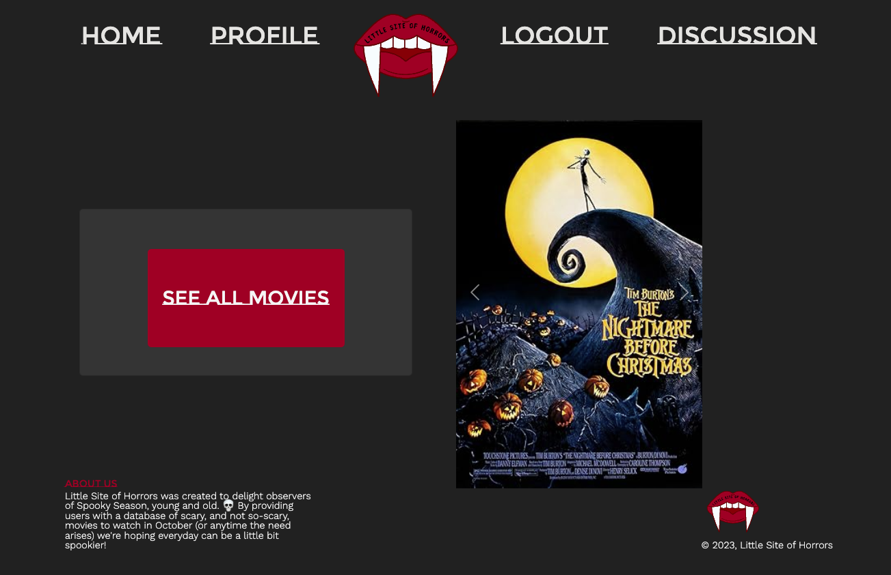

# littleSiteOfHorrors

## Description

The Little Site of Horrors was created for the die-hard gore fans and the easily startled fans alike! Our motivation for creating this website was to have a place where horror movie fans of all genre's and spooky scales can come together to meet and bond over their favorite movies.

## Table of Contents (Optional)

- [Installation](#installation)
- [Usage](#usage)
- [Credits](#credits)
- [License](#license)

## Installation

N/A

## Usage

When the user arrives at The Little Site of Horrors they can click a “See All Movies” button to see all the movies on the database. To create a profile click the “Login” button and sign up. Once they are logged in they can create a profile.

On their profile they can pick an avatar, answer three questions about their favorite spooky season snacks, activities, and costumes. In addition to answering questions, once the user is logged in they can also add movies from the all movies page to their favorited movies. When the user goes to their profile they can list their top five favorite movies and have a carousel of their favorited movies.

    ```md
    
    ```

## Credits

[Lillian Edwards](https://choosealicense.com/).
[Steven Rodriguez](https://github.com/StevenRodriguezDev).
[Maya Nettath](https://github.com/mnettath).
[Alex Purfield](https://github.com/AlexPurfield).
[Lia Kahn](https://github.com/ljkahn).

## License

Please refer to the license in the repo.

## Features

If your project has a lot of features, list them here.

## How to Contribute

If you created an application or package and would like other developers to contribute it, you can include guidelines for how to do so. The [Contributor Covenant](https://www.contributor-covenant.org/) is an industry standard, but you can always write your own if you'd prefer.

## Tests

Go the extra mile and write tests for your application. Then provide examples on how to run them here.
